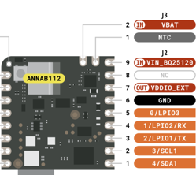
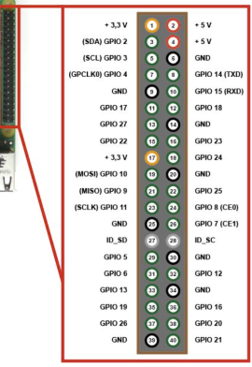

# ProBell – Winkelmessgerät mit Nicla Sense ME & Raspberry Pi Zero 2 W

Das System misst und visualisiert Winkel (Roll · Pitch · Yaw) mithilfe des **Nicla Sense ME**.  
Die Sensor-Quaternionen werden per **UART (TX/RX)** an einen **Raspberry Pi Zero 2 W** übertragen.  
Sobald der Pi Strom erhält …

1. startet automatisch das Python-Backend **`app.py`**,  
2. spannt einen WLAN-Hotspot **WinkelPi** (SSID) auf und  
3. stellt die Web-GUI unter **<http://192.168.4.1:5000>** bereit.

👉 **Kein** App-Download, **keine** lokale Installation – Tablet, Smartphone oder Laptop reichen völlig.

---
## Zusätzliche Doku

- [Modulübersicht](Doku/MODULUEBERSICHT.md)
- [Schwingkalibrierung](Doku/SCHWINGKALIBRIERUNG.md)
- [Setup Raspberry Pi](Doku/SETUP.md)
---
## Kernfunktionen

| Kategorie            | Details                                                                            |
| -------------------- | ---------------------------------------------------------------------------------- |
| **Live-Anzeige**     | Roll · Pitch · Yaw in Echtzeit (50 Hz)                                              |
| **Kalibrierung**     | • Schwing-Kalibrierung  • Statische Kalibrierung                                   |
| **Daten-Logging**    | CSV-Export der Roh-Quaternionen und berechneten Winkel                             |
| **Analyse-Tools**    | Maxima / Minima, FFT-Spektrum, Pendeldauer-Ermittlung                              |

---

---
## Hardware
| Stück | Teil                     | Hinweis                                                  |
|-------|--------------------------|----------------------------------------------------------|
| 1     | **Raspberry Pi Zero 2W** |                                                          |
| 1     | **micro‑SD 8GB+**        | neu flashen, Klasse10, FAT32                             |
| 1     | **5V / ≥2,5A Netzteil**  | versorgt **Pi + Nicla** (Oder Powerbank / Batterie etc.) |
| 1     | **Nicla Sense ME**       | UART‑Pins D0/D1 verwendet                                |
| –     | Kabel                    | 5 V, GND, TX/RX kreuzen                                  |
| 1     | Gehäuse                  |                                                          |

---
## Verkabelung

 

| Raspberry Pi Zero 2 W | Signal       | Nicla Sense ME |
|-----------------------|--------------|----------------|
| Pin 4  (5 V)          | 5 V  →       | VIN            |
| Pin 6  (GND)          | GND →        | GND            |
| Pin 8  (GPIO14 TX)    | TX  →        | **D0 (RX)**    |
| Pin 10 (GPIO15 RX)    | ← RX         | **D1 (TX)**    |

---
## Bedienung und Anwendung

